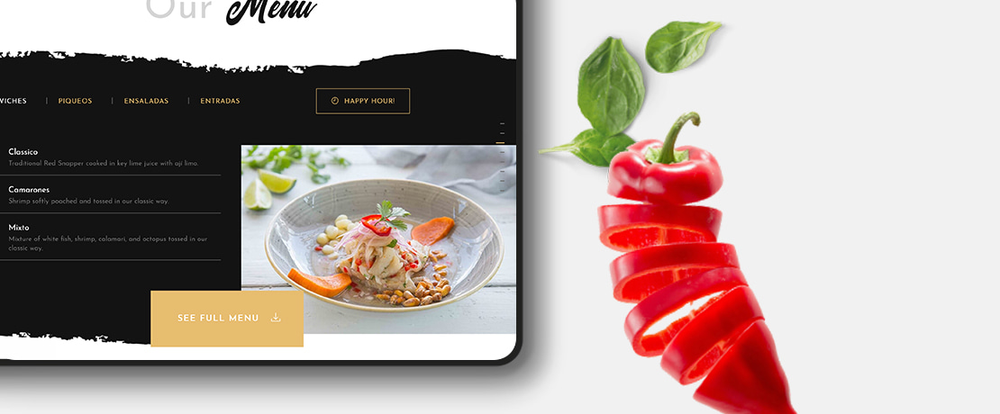

# DineDesign


## Overview
```DineDesign``` is a multipurpose, versatile, and interactive based full stack restaurant web application that streamlines user authentication and authorization, dining experience, facilitates seamless table reservations, Augmented Reality based food ordering and customizations. Websockets and WebRTC facilitates the real-time customer-AI Bot interaction and food-lessons tutorial streaming
## Frontend

### 1. Getting Started
   Prerequisites 
  Before proceeding with the installation, ensure that you have the following prerequisites:

  * Node (v12 or higher)
  * npm
  * Internet connection to fetch dependencies

### 2. Installation
     
  To install the DineDesign web app, follow these steps:
     
  * Clone the repository from the GitHub repository.
  * Navigate to the project directory.
  * Run npm install to install the required dependencies.
  * Running the Web App
    To run the DineDesign web app locally, execute the following command:

    ```
      npm run dev
    ```
  The web app will be accessible at http://localhost:3000.

### 3. Technology Stack for Frontend

  * Nextjs - A React Framework
  * Axios
  * Tailwind CSS

## Backend

### 1. Technology Stack for Backend

  * Languages: Javascript
  * Tools Used: WebRTC, Websockets, WebGL, RESTAPIs
  * Database: MongoDB
    
### 2. Features
* User Authentication and Authorization
* Making Reservations
* Augmented Reality Menu & Food Customization
* Food Order
* Order Tracking
* AI-Bot Customer Service
* Real-time Food Lessons


### 3. Source files description
```./server.js```runs the server for the user authentication and authorization service, making reservation, and real-time food lessons. It lets users to register, login, reset password and delete their account. The password is hashed and a token is generated upon registration. The token refreshed after every login. The user credentials and reservation details are stored in MongoDB. Real-time food lessons are performed using WebRTCs<br>

### Running the Webapp
   #### 1. Clone the repo:
   ```
      git clone https://github.com/rishikeshydv/DineDesign.git
   ```
   #### 2. Set directory to the repo 
   ```
      cd DineDesign
   ```
   #### 3. Run the Backend Server:
   ```
      node index.js
   ```
   The server runs on port 4000.

   #### 4. To start the frontend, navigate to the nextjs folder:
   ```
      cd nextjs
   ```
   #### 5. Install all frontend dependencies:
   ```
      npm install
   ```
   #### 6. Start the frontend development server:
   ```
      npm run dev
   ```
   ###### Access the app in your browser by visiting: http://localhost:3000

